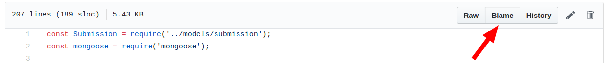

# Esercitazione **git**

## Setup del repository
Creare una cartella, entrarci e creare un file
```
mkdir esercitazione
cd esercitazione
echo "const port = 3000;" >> app.js
```

Inizializzare il repository
```
git init
```

Si può verificare lo stato del repository con il comando 
```
git status
```

Settare alcune impostazioni riguardo a chi siamo ed al nostro editor preferito
```
git config --global user.name "name"
git config --global user.email "email"

git config --global core.editor "favourite editor"
```

## Salvare le modifiche
Aggiungere le modifiche del repository alla staging area e creare un nuovo commit con un messaggio di descrizione.
```
git add app.js
git commit -m "Add port constant"
```

## Tornare ad uno stato precedente
Dopo aver aggiunto alcune modifiche al file *app.js*, averle aggiunte alla staging area ed aver creato un nuovo commit è possibile tornare allo stato del commit precedente:
dopo aver trovato l'id del commit a cui si vuole ripristinare il repository con il comando
```
git log --oneline
```
che permette di visualizzare il log dei commit, si usa il comando
```
git checkout "id"
```

Per tornare all'ultimo stato si usa
```
git checkout master
```

## Branching e merging

### Fast forward merging
Creare un nuovo branch branch con
```
git branch "feature"
```
Spostarsi nel nuovo branch
```
git checkout "feature"
```

Aggiungere alcune modifiche al file *app.js*, aggiungerle alla staging area e committarle.

Quando si ha finito di lavorare alla feature nel relativo branch si effettua il merge sul master con
```
git checkout master
git merge feature
```

### 3-way merge
Creare un nuovo branch
```
git branch new-feature
```

Prima di spostarsi nel nuovo branch, modificare il branch master
```
echo "# Title" >> README.md
git add .
git commit -m "Add README"
```

Spostarsi nel nuovo branch e modificare il file *app.js*, per esempio modificando la porta a 3001
```
git checkout new-feature
// modificare il file app.js
git add .
git commit -m "change port const
```

Tornare sul branch master ed effettuare il merge
```
git checkout master
git merge new-feature
```

Si può vedere il grafo dei commit sui vari branch con
```
git log --graph --decorate --oneline
```

### Risolvere un conflitto durante un merge
1. Creare un branch *3002* dove si modifica la porta a 3002.
2. Creare un branch *8000* a partire dal branch master dove si modifica la porta a 8000.
3. Fare un merge sul master del branch 3002.
```
git merge 3002
```
4. fare un merge sul master del branch 8000.
```
git merge 8000
```
5. Verrà mostrato un errore che avviserà di un conflitto.
6. Risolvere il conflitto, aggiungere la modifica alla staging area e committare.

## Rebasing
1. Creare un branch dal master e, prima di spostarsi nel nuovo branch, fare delle modifiche nel master, con relativo add e commit.
2. Spostarsi nel branch creato e fare un po' di modifiche.

3. Prima e dopo l'esecuzione del rebase è interessante lanciare il comando
```
git log --graph --decorate --oneline
```
per vedere i cambiamenti.

4. Effettuare il rebase con il comando 
```
git rebase master
```

**Nota:** si può ripetere il rebasing rendendolo più interessante creando un conflitto tra la versione del master e quella nel nuovo brannch.

## Rebase interattivo
1. Creare un branch dal master
2. Fare alcune modifiche nel master, fare add e committare
3. Spostarsi nel nuovo branch
4. Fare alcune modifiche conflittuali nel nuovo branch rispetto al master, fare add e commit.
5. Fare modifiche, add e commit almeno altre due volte nel nuovo branch.
6. Fare rebase squashando tutti i commit in un unico.

## Tagging
Per creare un tag che punti al commit attuale si usa il comando 
```
git tag "nome_tag" // Gli spazi non sono ammessi
```

Per inserire un tag ad un commit preciso si usa
```
git tag "nome_tag" "id commit"
```

Dando il comando
```
git log --oneline
```
è possibile vedere la storia dei commit con i tag associati.

## Blaming
Andare su [github](github.com "github"), aprire un qualsiasi file e in alto a destra sopra al file si può notare il pulsante **Blame**.


# Esercitazione **github**

Creare un repository su github.

Clonare il repository con
```
git clone "URL"
```

Creare un file, aggiungerlo alla staging area e committare.

Aggiornare il repository remoto con le modifiche locali
```
git push
```

Modificare il file su github e aggiornare il repository locale con le modifiche remote con
```
git pull
```

Creare un branch e pusharlo sul repository remoto con
```
git push origin "nome branch"
```