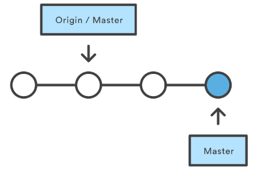
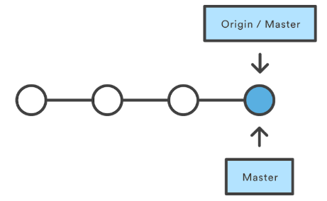

# Riassunto GIT
***

# Comandi

    git init
Crea un nuovo repository.

    git status
Mostra lo stato della working directory e della staging area.
    
    git config --global user.name "name"
    git config --global user.email email
Imposta chi sono io.
[Maggiori informazioni su git config](https://www.atlassian.com/git/tutorials/setting-up-a-repository/git-config
 "git config")

    git add
Organizza le modifiche al progetto che verranno salvate con un successivo commit.

    git commit
Cattura uno snapshot del progetto con le modifiche salvate al momento nel repository locale.

Opzioni:
- -m "Messaggio"
- -a: salva automaticamente i file che sono stati modificati o cancellati, ma non aggiunge eventuali nuovi file se non è specificato
- --amend: modifica l'ultimo commit invece che crearne uno nuovo.
##
    git checkout 'id/nome'

Ripristina la working directory ad un commit. Lo fa aggiornando il puntatore HEAD.

    git log
Mostra gli snapshot committati. Permette di vedere la cronologia del progetto, filtrarla e cercare specifiche modifiche.

    git branch
Permette di creare, listare, rinominare ed eliminare branch:
- Creare: git branch "nome"
- Cancellare: git branch -d "nome" (-D per forzare un branch non ancora completamente merged)

    git merge 'nome_branch'
Unisce il branch passato come argomento al branch attuale (precedentemente impostato con git checkout).

    git clone
Permette di ottenere una copia locale di un progetto precedentemente impostato in un repository centrale.

    git push
Aggiorna il repository centrale con le modifiche del repository centrale.

    git pull
Aggiorna il repository locale con le modifiche del repository centrale.

    git remote
Permette di creare, vedere ed eliminare connessioni ad altri repository:
- Creare: git remote add 'nome' 'URL'
- Eliminare: git remote rm 'nome'
- Rinominare: git remote rename 'old' 'new'
- Visualizzare: git remote show 'nome'

Opzioni:
- -v | --verbose: visualizza i nomi e i rispettivi URL.
##

    git remote add 'nome' 'URL'
In particolare, permette di collegare un repository locale, precedentemente creato con 'git init', ad un repository centrale.

    git push 'nome_remote' 'nome_branch'
Permette di salvare un branch che esiste solo localmente anche sul repository centrale puntato da 'nome_remote'

    git fetch --all
Permette di fare un fetch su tutti i remote registrati e i loro branch.

    git merge origin/master
Unisce i cambiamenti di un repository remoto con il proprio locale.

    git push 'remote' 'branch'
Carica il branch specificato nel repositori puntato da 'remote'.

    git rm --cached 'filename'
Elimina il file specificato dal repository remoto. Omettendo '--cached' il file viene eliminato anche dal repository locale.

# Definizioni

#### branch
E' un puntatore ad un commit, non ha un nome leggibile. I branch sono utili quando si introduce una nuova feature o si fixa un bug per evitare di introdurre codice instabile nel main branch. In questo modo un branch può rappresentare una serie di commit.

##### master branch
E' il branch di default creato alla creazione del repository.

##### HEAD
E' un puntatore alla versione attuale del commit. All'inizio punta al master.

#### Merging di branch
E' il processo tramite il quale la cronologia biforcata in diversi merge viene riunita nella main code base.

##### fast-forward merge
Si può utilizzare quando esiste un percorso lineare dal branch corrente al branch di destinazione (il branch di destinazione deriva dal branch corrente). Semplicemente git muove il puntatore in avanti al branch di destinazione.

##### 3-way-merge
Il fast-forward merge non è possibile se i branch hanno delle divergenze. Questo metodo utilizza un terzo merge in cui unire i due branch. E' più utilizzato per unire feature molto grandi e di lunga durata di sviluppo.

##### Risolvere i conflitti di merging
Se in entrambi i branch che si intende unire si è modificata la stessa parte dello stesso file, git non sarà in grado di capire quale mantenere. In questo caso è necessario risolvere il conflitto manualmente. "git status" può essere utile in questo caso per vedere quali file hanno bisogno di essere risolti.

#### Git remote
E' un modo facile per passare URL a comandi come git push e pull. Quando si fa 'git clone', automaticamente viene creata una connessione remota chiamata origin, che punta al repository clonato, facilitando una successiva operazione 'git pull'. Le connessioni remote non sono altro che dei "Bookmark", un modo per riferirsi tramite dei semplici nomi a degli URL.

#### Fetch
Git fetch scarica i commit ed i file da un repository remoto al locale. Si usa 'git fetch' quando si intende vedere su cosa ha lavorato qualcun altro, non ci forza a fare un merge con le modifiche attualmente presenti attualmente in locale. Git fetch non ha assolutamente alcun effetto sul lavoro locale. I contenuti fetchati vanno poi esplicitamente checkati con git checkout.

#### Pull
Combina un 'git fetch' e unisce il contenuto del repository remoto con l'HEAD in un nuovo merge commit locale.

#### Push
Carica il contenuto del repository locale in un repository remoto. E' la controparte di 'git fetch'. Git non permette di effettuare il push se il merge non sarà di tipo fast-forward. In tal caso, prima si deve fare 'git pull' e risolvere i conflitti, infine rieseguire 'git pull', oppure si può  utilizzare l'opzione --force.

#### Ignorare file
I file nella nostra directory locale possono essere di tre tipi:
- Tracked: precedentemente committati.
- Untracked: file non committati.
- Ignored: file che a Git è stato esplicitamente detto di ignorare.

Sono solitamente file compilati o file generati dalla macchina.

Per ignorare un file si deve aggiungere manualmente al file '.gitignore', che dev'essere poi committato. Nel file .gitignore è possibile aggiungere commenti utilizzando il carattere '#'.

#### Stashing
il comando 'git stash' ripone momentaneamente le modifiche fatte sulla nostra copia di lavoro, per poter lavorare su qualcos'altro ed in seguito tornare indietro e riapplicarle più tardi. E' molto utile quando si deve cambiare contesto e lavorare su altro, ma si è a metà di un cambiamento nel codice che non si è però pronti a committare. In pratica 'git stash' salva le modifiche attualmente non committate per un futuro utilizzo e le rimuove dalla cartella di lavoro attuale.